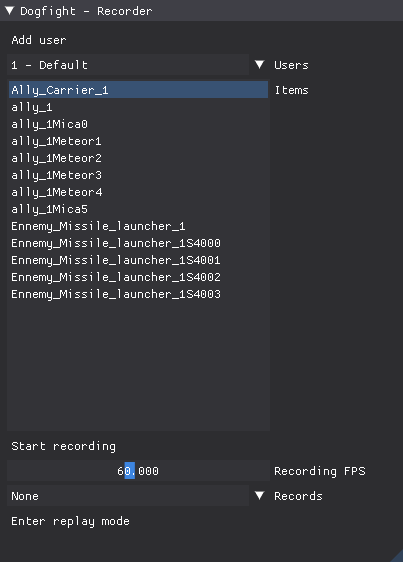
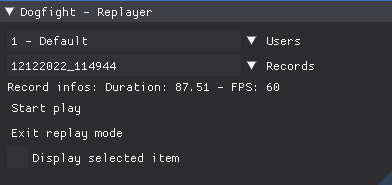
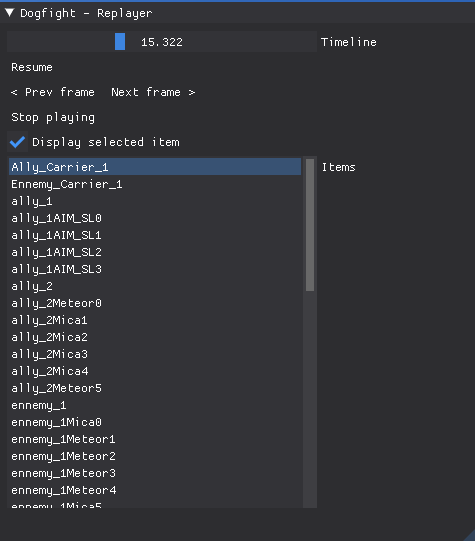
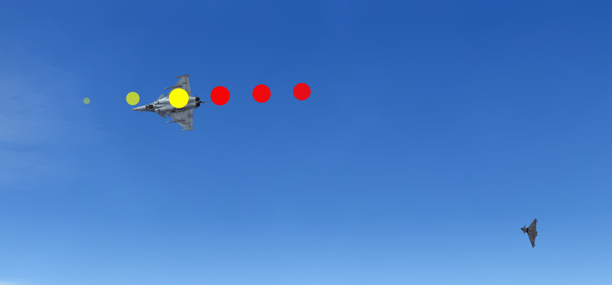

# Dogfight 2 (Air to air combat Sandbox)

Air to air combat sandbox, created in Python 3 using the [HARFANG 3D 2 framework](https://www.harfang3d.com).

**Table of content**

- [Dogfight 2 (Air to air combat Sandbox)](#dogfight-2-air-to-air-combat-sandbox)
  - [How to run the Dogfight Sandbox](#how-to-run-the-dogfight-sandbox)
    - [Using the official release](#using-the-official-release)
    - [Using the cloned repository](#using-the-cloned-repository)
  - [About VR mode](#about-vr-mode)
  - [Recorder API overview](#recorder-api-overview)
    - [Replay](#replay)
    - [Events](#events)
  - [Network mode overview](#network-mode-overview)
    - [Startup](#startup)
  - [Aircraft keyboard Commands](#aircraft-keyboard-commands)
  - [Commons Views commands](#commons-views-commands)
  - [Aircrafts views commands](#aircrafts-views-commands)
  - [FPS camera views commands](#fps-camera-views-commands)
  - [Debug views commands](documentation_debug.md)
  - [Supported control devices](#supported-control-devices)
  - [How to configure input devices](#how-to-configure-input-devices)
    - [Devices configuration](#devices-configuration)
    - [Inputs mapping files](#inputs-mapping-files)
  - [Contributors](#contributors)
  - [Screenshots](#screenshots)
  - [Publications, citations and research projects](#publications-citations-and-research-projects)
    - [Harfang3D Dog-Fight Sandbox: A Reinforcement Learning Research Platform for the Customized Control Tasks of Fighter Aircrafts](#harfang3d-dog-fight-sandbox-a-reinforcement-learning-research-platform-for-the-customized-control-tasks-of-fighter-aircrafts)

[](https://www.youtube.com/watch?v=4Q2f0dKh8vE)

The game features :

* VR (on any SteamVR compatible headset)
* Ocean / terrain shader
* Skydome shader
* Clouds
* Autopilot (Take-off, landing, fight)
* Network mode

The source code and the graphics assets are made available for studying purpose. However, you are free to fork this repository, extend the game or release anything that is based on it.

## How to run the Dogfight Sandbox

### Using the official release

1. Download the [most recent release](https://github.com/harfang3d/dogfight-sandbox-hg2/releases) (dogfight-sandbox-hg2-win64.7z)
1. Unzip it
1. run *start.bat*
1. Select a scenario using the `right` and `left` keys
   * Press `space` if you want to control the aircraft using the keyboard
   * Press the `start` button of the gamepad or the joystick depending on the device you want to use
   * If you press the `start/fire` button on the gamepad, the Sandbox will automatically define this controler as the input device of the aircraft (see **Aircraft keyboard Commands** below for the details of the keyboard inputs)

### Using the cloned repository

1. :warning: If you want to run the sandbox *from the cloned repository*, you will need install the requirements, following the `requirements.txt` files found in the `source\` and `Agent\` folders.
   1. or run `0-install-requirements.bat`
2. open a cmd line, enter the `source` folder (`cd source`) and run `python main.py`
   1. or run `start.bat` or `1-start.bat`
   2. or, in **VSCode** press `CTRL-F5`

## About VR mode

* VR works on Windows machines only, using the DirectX backend (set `"OpenGL": false` in the **config.json** file)
* All the views are available in VR (exterior, interior). When using the cockpit view (`3` on the numpad), press `F11` to calibrate the position of the head
* Requires SteamVR (1.22.x) at least
* Tested on the following headsets with success:
  * LENOVO VR Explorer
  * HTC Vive, HTC Vive Pro
  * Meta Quest 2, Meta Quest 3, Meta Quest Pro (using Meta Quest Link)
  * Pico Neo 3 Pro Eye (using Pico Business Streaming)

## Recorder API overview

1. Choose the mission you want to record.  
2. Type "F9" to open the recorder interface:  
  

* `Add user` : You can add a user. Each user has his own list of records.  
* `Users` : Use this combo boxe to selected the user.  
* `Item`: List of recordable items.  
* `Start recording`: Record the simulation.  
* `Recording FPS` : Recording frequency (Frame Per Second).  
* `Records`: Select record to replay.  
* `Enter replay mode`: Replayer.

### Replay  

  

* Select the user and record you want to replay.  
* Press `Start play`  
  The items are created. You can pause the replay, and move the Timeline cursor.  
  
* `Display selected item`: Display a sight on selected item, to identify the item in 3D view.  
* `Prev frame`, `Next frame`: Backward / foreward frame by frame. You can also press `-`, `+` on keyboard.  

### Events

Hits (missiles, machine gun, crashes) are recorded and displayed as circles during replay:  

Yellow circles : before the event  
Red circles : after the event  
The maximum size of the circle depends on the power of the collision.

## Network mode overview

The "Network" mode allows you to control the planes from a third party machine.  

### Startup

1. On the server machine:  
    * Start the DogFight SandBox (start.bat file)  
    * Choose the **Network mode** mission  
     
    * Note the IP and port number of the server, in the upper left corner of the screen
     

1. On the client machine:  
    * Make sure you have a version of python 3 installed  
    * Copy the content of the directory `network_client_example`.  
    * Open the file `client_sample.py` with a text editor.
    * Enter the server ids in the "df.connect ()" function.  
    
    * Start the file `client_sample.py`

## Aircraft keyboard Commands  

| Command | Key |
| ------- | :-: |
| Increase thrust level | Home |
| Decrease thrust level | End |
| Increase brake level | B |
| Decrease brake level | N |
| Increase flaps level | C |
| Decrease flaps level | V |
| Roll left | Left |
| Roll right| Right |
| Pitch up| Up |
| Pitch down| Down |
| Yaw left| Suppr |
| Yaw right| PageDown |
| Switch post combustion| Space |
| Next target | T |
| Switch gear | G |
| Activate IA | I |
| Activate Autopilot | A |
| Switch easy steering mode | E |
| Fire machine gun | Enter |
| Fire missile | F1 |
| Increase health level | P |
| Decrease health level | M |
| Rearm | F5 |
| HUD on /off | H |

## Commons Views commands

| Command | Key |
| ------- | :-: |
| Roll cameras carousel (aircrafts, FPS) | 1 |
| Increase FoV angle | PageUp |
| Decrease FoV angle | Insert |

## Aircrafts views commands

| Command | Key |
| ------- | :-: |
| Back view | 2 |
| Front view | 8 |
| Left view | 4 |
| Right view | 6 |
| Satellite view | 5 |
| Tactical view | 7 |
| Pursuit view | 9 |
| Cockpit view | 3 |

## FPS camera views commands

| Command | Key |
| ------- | :-: |
| Head orientation | LMB + mouse move |
| Move forward | Up, Z |
| Move backward | Down, S |
| Move left | left, Q |
| Move right | right, D |
| Fast speed 1 | Left Shift + move |
| Fast speed 2 | Left Ctrl + move |
| Fast speed 3 | Right Ctrl + move |

## Supported control devices

* Keyboard
* XBox gamepad or any compatible model
* Logitech "Attack 3" Joystick

## How to configure input devices

There are two types of command configuration files.

* sources/scripts/devices_config.json  
  * Contains informations about your control devices
* sources/scripts/XXX_inputs_mapping.json  
  * These files contain the command parameters for the different vehicles or systems.

### Devices configuration

The `devices_config.json` file contains the inputs parameters of the device.  

Input of "axis" type

```json
"GA_LeftX": {
            "type": "axis",
            "name": "Left pad horizontal",
            "reset": "true",
            "invert": "false",
            "id": 0,
            "min": -1,
            "max": 1,
            "zero": -0.0156,
            "zero_epsilon": 0.01
        }
```

Input of "button" type

```json
"GB_Start": {
            "type": "button",
            "id": 7,
            "name": "Start"
        },
```

* `GA_LeftX` or `GB_Start`: The input id used in `XXX_inputs_mapping.json` files.
* `type`: "axis" or "button"
* `name`: The input name, used for displays
* `reset`: True if the axis returns to its "zero" position when released
* `invert`: True if you want to invert the command (returned value * -1)
* `id`: Internal id of the axis (int)
* `min`, `max`: clamped bounds values of the axis
* `zero`: returned value when axis is on its "reset" position.
* `zero_epsilon`: Define an epsilon if the zero value is not stable.

### Inputs mapping files

The `XXX_inputs_mapping.json` files contains the inputs mapping for the systems commands:
  
* Aircraft user commands: When user controls the aircraft.
* Aircraft Autopilot user commands: When Autopilot is activated.
* Aircraft IA commands: When IA controls the aircraft, the only user commande is IA deactivation.
* Missile Launcher user commands: When user controls the Missile Launcher (only missiles targetting and fire for the moment !)

For Keyboard, inputs ids are the same as HARFANG3D [Keys enums](https://dev.harfang3d.com/api/3.2.5/cpython/constants/#key)

____

## Contributors

* Code, design, music / sfx:
  * Eric Kernin
  * Quentin Rigagneau
* 3D graphics:
  * Jean-Marie Lamarche
  * Bruno Lequitte
* Technology & design advisory:
  * Muhammet Aksoy
  * Pr. Emre Koyuncu
  * Michel Nault
  * Muhammed Murat Özbek
  * Thomas Simonnet

## Screenshots


## Publications, citations and research projects

### 📎 Harfang3D Dog-Fight Sandbox: A Reinforcement Learning Research Platform for the Customized Control Tasks of Fighter Aircrafts

(Muhammed Murat Özbek, Süleyman Yıldırım, Muhammet Aksoy, Eric Kernin, Emre Koyuncu)

[Harfang3D Dog-Fight Sandbox: A Reinforcement Learning Research Platform on arxiv.org](https://arxiv.org/abs/2210.07282)

_How to cite this publication:_
 
```
@misc{2210.07282,
  Author = {Muhammed Murat Özbek,  Süleyman Yıldırım,  Muhammet Aksoy, Eric Kernin and Emre Koyuncu},
  Title = {Harfang3D Dog-Fight Sandbox: A Reinforcement Learning Research Platform for the Customized Control Tasks of Fighter Aircrafts},
  publisher = {arXiv},
  doi = {10.48550/ARXIV.2210.07282},
  Year = {2022},
  Eprint = {arXiv:2210.07282},
}
```
### 🧠 Highly Imitative Reinforcement Learning for UCAV 

Air to air combat sandbox, created in Python 3 using the HARFANG 3D 2 framework. This project provides a rich environment for air combat simulation and has been utilized in advanced research projects, including the latest in reinforcement learning strategies for unmanned combat aerial vehicles (UCAV), developed at a leading Chinese university. For more on this innovative approach, [see the HIRL4UCAV project on GitHub](https://github.com/zrc0622/HIRL4UCAV).

### :orange_book: Further Reading

For a complete list of academic publications and citations related to the Dogfight Sandbox, refer to [Academic References](academic_references.md).

### An Imitative Reinforcement Learning Framework for Autonomous Dogfight

(Siyuan Li, Rongchang Zuo, Peng Liu, Yingnan Zhao)

[An Imitative Reinforcement Learning Framework for Autonomous Dogfight](https://arxiv.org/abs/2406.11562)

_How to cite this publication:_

```
@misc{2406.11562,
  Author = {Siyuan Li, Rongchang Zuo, Peng Liu, Yingnan Zhao}
  Title = {An Imitative Reinforcement Learning Framework for Autonomous Dogfight}
  publisher = {arXiv},
  doi = {10.48550/ARXIV.2406.11562},
  Year = {2024},
  Eprint = {arXiv:2406.11562},  
}
```